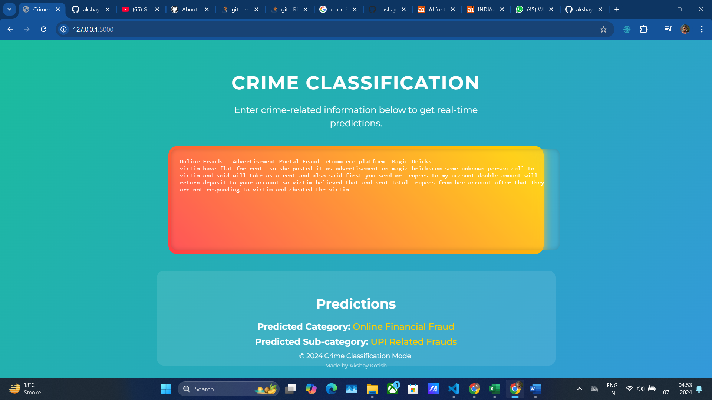

---

# Crime Classification Model from Scratch



**Author:** Shivam Kumar (Akshay Kotish)

---

## Table of Contents

- [Introduction](#introduction)
- [Features](#features)
- [Dataset](#dataset)
- [Model Architecture](#model-architecture)
- [Detailed Model Explanation](#detailed-model-explanation)
- [Installation](#installation)
- [Usage](#usage)
  - [Running the Model](#running-the-model)
  - [Web Application](#web-application)
- [Code Explanation](#code-explanation)
- [Screenshot](#screenshot)
- [License](#license)
- [Acknowledgments](#acknowledgments)
- [Contact](#contact)
- [How to Contribute](#how-to-contribute)
- [Notes](#notes)

---

## Introduction

This project is a **Crime Classification Model** built from scratch using TensorFlow and Keras. It was created as part of the **Cyber Guard Hackathon** by **Shivam Kumar (Akshay Kotish)**. The model is designed to predict the **category** and **sub-category** of a crime based on provided textual information. The project includes a machine learning model trained on custom data and a web application with a modern, interactive UI for real-time predictions.

---

## Features

- **Custom Deep Learning Model:** Built from scratch using TensorFlow and Keras.
- **Real-Time Predictions:** Instantaneous category and sub-category predictions as users input text.
- **Interactive Web Interface:** A visually appealing web application built with Flask and enhanced with modern UI/UX design.
- **Data Preprocessing:** Comprehensive data handling including tokenization, padding, and label encoding.
- **Model Persistence:** Saving and loading of the trained model for future use.
- **From Scratch Implementation:** All code is written from the ground up without reliance on pre-built models.

---

## Dataset

The model is trained on a dataset consisting of crime-related textual information with corresponding categories and sub-categories. The dataset files are:

- `train.csv`: Contains training data with columns `crimeaditionalinfo`, `category`, and `sub_category`.
- `test.csv`: Contains test data for evaluating the model's performance.

**Note:** Ensure that these CSV files are properly formatted and located in the project's root directory.

---

## Model Architecture

The model is a sequential neural network consisting of:

- **Embedding Layer:** Converts text input into embeddings.
- **Bidirectional LSTM Layers:** Captures temporal dependencies in both forward and backward directions.
- **Fully Connected Dense Layers:** Learns complex patterns for classification.
- **Output Layer:** Outputs probabilities for each combined category and sub-category class.

**Model Summary:**

1. **Embedding Layer**
2. **Bidirectional LSTM (128 units)**
3. **Bidirectional LSTM (64 units)**
4. **Dense Layer (128 units, ReLU)**
5. **Dropout Layer (0.5)**
6. **Dense Layer (64 units, ReLU)**
7. **Dropout Layer (0.5)**
8. **Dense Output Layer (Softmax Activation)**

---

## Detailed Model Explanation

### Introduction to LLM (Large Language Model)

While this model is not a transformer-based LLM like GPT-3, it leverages deep learning techniques to process and understand natural language text. The model focuses on text classification, a fundamental task in Natural Language Processing (NLP).

### Components of the Model

#### 1. **Embedding Layer**

- **Purpose:** Transforms each word in the input text into a dense vector representation (embedding).
- **Why Embeddings?** Embeddings capture semantic relationships between words, allowing the model to understand context and meaning.
- **Implementation:** The embedding layer has an input dimension equal to the size of the vocabulary and an output dimension of 256.

#### 2. **Bidirectional LSTM Layers**

- **LSTM (Long Short-Term Memory):** A type of Recurrent Neural Network (RNN) capable of learning long-term dependencies.
- **Bidirectional Processing:** Processes the input sequence from both forward and backward directions, capturing information from past and future tokens.
- **First LSTM Layer:**
  - **Units:** 128
  - **Return Sequences:** True (outputs the full sequence for the next layer)
  - **Dropout:** 0.3 (regularization to prevent overfitting)
- **Second LSTM Layer:**
  - **Units:** 64
  - **Dropout:** 0.3
- **Why LSTMs?** They are effective for sequence data and can capture the temporal dynamics of language.

#### 3. **Dense Layers**

- **First Dense Layer:**
  - **Units:** 128
  - **Activation:** ReLU (Rectified Linear Unit)
- **Dropout Layer:**
  - **Rate:** 0.5
- **Second Dense Layer:**
  - **Units:** 64
  - **Activation:** ReLU
- **Dropout Layer:**
  - **Rate:** 0.5
- **Purpose:** These layers learn complex, non-linear relationships in the data, enhancing the model's ability to classify correctly.

#### 4. **Output Layer**

- **Units:** Equal to the number of unique combined category and sub-category classes.
- **Activation:** Softmax
- **Purpose:** Produces a probability distribution over all classes, allowing the model to output the most probable class.

### How the Model Works

1. **Input Processing:**
   - The input text is tokenized and converted into sequences of integers representing words.
   - Sequences are padded to a fixed length (`max_length = 512`) to ensure uniform input size.

2. **Embedding Layer:**
   - Each integer (word index) is mapped to a 256-dimensional embedding vector.
   - This layer creates a dense representation of words that captures semantic meaning.

3. **Bidirectional LSTM Layers:**
   - The embeddings are passed through two stacked Bidirectional LSTM layers.
   - **First Layer:**
     - Processes the sequence and outputs a sequence (since `return_sequences=True`).
     - Captures both past (forward) and future (backward) context.
   - **Second Layer:**
     - Further processes the sequence and outputs the final hidden states.

4. **Flattening the Output:**
   - The output from the LSTM layers is flattened into a fixed-size vector that represents the entire input sequence.

5. **Dense Layers:**
   - The flattened vector is passed through two dense layers with ReLU activation functions.
   - Dropout layers are included after each dense layer to prevent overfitting by randomly setting input units to zero during training.

6. **Output Layer:**
   - The final dense layer outputs a vector with a length equal to the number of classes.
   - The Softmax activation function converts this vector into a probability distribution.

7. **Prediction:**
   - The class with the highest probability is selected as the model's prediction.
   - The predicted class index is mapped back to the corresponding category and sub-category using label encoders.

### Training Details

- **Loss Function:** `sparse_categorical_crossentropy` is used because the target variable is an integer representing class labels.
- **Optimizer:** Adam optimizer with a learning rate of 0.0001 is used for efficient training.
- **Metrics:** Accuracy is tracked during training and validation.
- **Epochs:** The model is trained for 10 epochs, which can be adjusted based on performance.

### Understanding Model Choices

- **Why Not Use Transformers or Pre-trained LLMs?**
  - The model is intentionally built from scratch to understand the fundamental concepts of deep learning in NLP.
  - Using LSTMs allows for learning from the sequential nature of text without relying on large pre-trained models.

- **Advantages of This Approach:**
  - **Educational Value:** Helps in understanding how models process text data at a fundamental level.
  - **Customization:** Allows for full control over the architecture and hyperparameters.
  - **Resource Efficiency:** Requires fewer computational resources compared to large transformer models.

### Potential Improvements

- **Incorporate Pre-trained Embeddings:**
  - Using embeddings like GloVe or Word2Vec can provide better initial word representations.
- **Use of Transformer Models:**
  - Implementing transformer architectures like BERT can enhance performance on NLP tasks.
- **Hyperparameter Tuning:**
  - Experimenting with different numbers of layers, units, dropout rates, and learning rates.

---

## Installation

### Prerequisites

- Python 3.6 or higher
- Virtual Environment (recommended)

### Required Packages

Install the required Python packages using `pip`:

```bash
pip install tensorflow pandas scikit-learn numpy flask
```

---

## Usage

### Running the Model

#### 1. **Clone the Repository**

```bash
git clone https://github.com/yourusername/crime-classification.git
cd crime-classification
```

#### 2. **Prepare the Dataset**

Ensure that `train.csv` and `test.csv` are in the project's root directory.

#### 3. **Train the Model**

Run the training script:

```bash
python train_model.py
```

**`train_model.py`** contains the code to load data, preprocess it, build the model, train it, and save the trained model to `saved_model/crime_classification_model.h5`.

#### 4. **Test the Model**

After training, you can evaluate the model's performance on the test data:

```bash
python test_model.py
```

**`test_model.py`** will load the saved model and calculate accuracy on `test.csv`.

### Web Application

#### 1. **Run the Flask App**

Start the Flask web application:

```bash
python app.py
```

#### 2. **Access the Web Interface**

Open your web browser and navigate to:

```
http://localhost:5000
```

#### 3. **Using the Application**

- **Input Text:** Enter crime-related information in the textbox.
- **Real-Time Predictions:** The application will display the predicted category and sub-category below the textbox as you type.

---

## Code Explanation

### 1. **Data Loading and Preprocessing**

- **Loading Data:** The CSV files are loaded using `pandas.read_csv()`.
- **Handling Missing Values:** Missing values in `crimeaditionalinfo` are filled with empty strings.
- **Label Encoding:** `category` and `sub_category` are label-encoded using `LabelEncoder` from scikit-learn.
- **Combined Labels:** A combined label is created by concatenating `category` and `sub_category`, which is also label-encoded.
- **Data Splitting:** The data is split into training and testing sets using `train_test_split`.

### 2. **Text Tokenization and Padding**

- **Tokenizer:** A `Tokenizer` from Keras is used to convert text to sequences.
- **Fitting Tokenizer:** The tokenizer is fitted on the training texts.
- **Text Sequences:** Text data is converted to sequences of integers.
- **Padding Sequences:** Sequences are padded to a maximum length (`max_length = 512`) using `pad_sequences`.

### 3. **Model Building**

- **Embedding Layer:** Converts input sequences into embeddings of dimension 256.
- **Bidirectional LSTMs:** Two Bidirectional LSTM layers capture temporal patterns.
- **Dense Layers:** Fully connected layers with ReLU activation learn complex features.
- **Dropout Layers:** Prevent overfitting by randomly dropping neurons during training.
- **Output Layer:** Uses Softmax activation to output probabilities for each class.

### 4. **Model Compilation and Training**

- **Compilation:** The model is compiled with the Adam optimizer, a learning rate of 0.0001, and `sparse_categorical_crossentropy` loss.
- **Training:** The model is trained for 10 epochs with a batch size of 32, including validation on the test set.

### 5. **Model Saving**

- The trained model is saved to `saved_model/crime_classification_model.h5`.

### 6. **Prediction Function**

- **Input Preprocessing:** The input text is tokenized and padded similarly to training data.
- **Model Prediction:** The model predicts the class probabilities for the input.
- **Label Decoding:** The predicted class index is converted back to the original `category` and `sub_category` using the label encoders.

### 7. **Flask Web Application**

- **Routes:**
  - `/`: Renders the main page with the text input interface.
  - `/predict`: Accepts AJAX POST requests with input text and returns predictions in JSON format.
- **Templates:** Uses `index.html` in the `templates` directory for the front-end.
- **Static Files:** Any static assets (CSS, JS) are served from the `static` directory.

### 8. **Front-End Design**

- **Modern UI/UX:** The interface uses a modern, animated design with custom CSS.
- **Interactive Elements:** The textbox and result display include animations and transitions.
- **Real-Time Updates:** As the user types, predictions are updated in real-time using AJAX.
- **Signature:** A footer signature credits Shivam Kumar (Akshay Kotish) as the creator.

---

## Screenshot


*An example of the web application's interface showcasing the input area and real-time predictions.*

---

## License

This project is licensed under the MIT License - see the [LICENSE](LICENSE) file for details.

---

## Acknowledgments

- **Cyber Guard Hackathon:** This project was created as part of the Cyber Guard Hackathon, fostering innovation in cybersecurity solutions.
- **TensorFlow and Keras:** For providing powerful tools to build deep learning models.
- **Flask:** For enabling the creation of the web application.
- **Bootstrap and Font Awesome:** For UI components and icons.
- **Community:** For support and inspiration in building this project from scratch.

---

## Contact

For any inquiries or feedback, please reach out:

- **Name:** Shivam Kumar (Akshay Kotish)
- **Email:** akshaykotish@gmail.com
- **GitHub:** [github.com/akshaykotish](https://github.com/akshaykotish)

---

## How to Contribute

Contributions are welcome! Please open an issue or submit a pull request for any improvements.

---

## Notes

- Ensure that you have sufficient hardware resources, especially if training the model on a large dataset.
- The UI is designed with modern browsers in mind; for the best experience, use the latest version of Chrome, Firefox, or Edge.
- Remember to replace placeholder links and contact information with your actual details.

---

**Made by Shivam Kumar (Akshay Kotish)**

---

Thank you for using the Crime Classification Model. Your feedback is valuable and helps improve the project!

---
